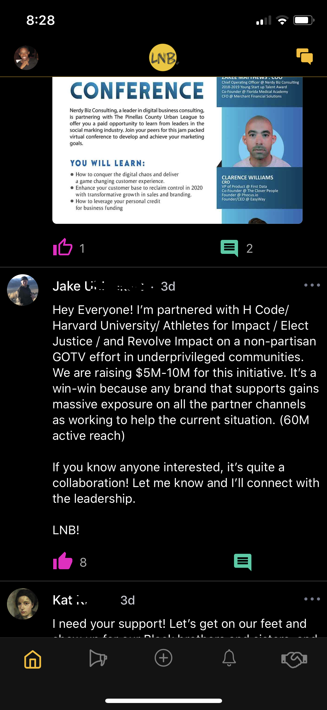
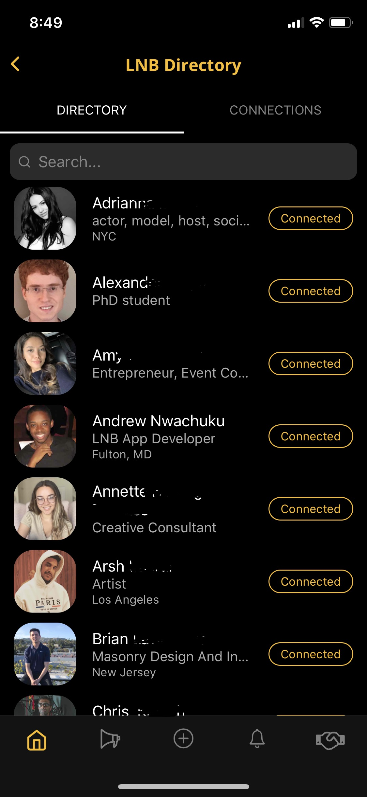

# App Description
- **Optimized for iOS**
- **Front-end built with React Native, using Redux & React-Redux for state management**
- **Integrated Firebase for Authentication, Database, Storage, & Functions**

## Current Features
**Build a network by connecting and collaborating with like-minded people**
- Share opportunities, news, and knowledge on a live feed
- Instant Messaging
- Push Notifications
- Search powered by Algolia

## Coming soon...
- In-App Marketplace for users to buy and sell products/services
- Plan and Share Events for users to be a part of
- QR Code Scan
- Machine Learning for improved user experience
- AR Integration
- Group Chat
- Trending News
- Full Android compatibility

# Screenshots
## Feed

    
    

## Drawer Menu

    
    

## Profile

    
    

    
## Directory

    
    

## Notifications

    
    

## Message Threads

    
    

## Chat

    
    

